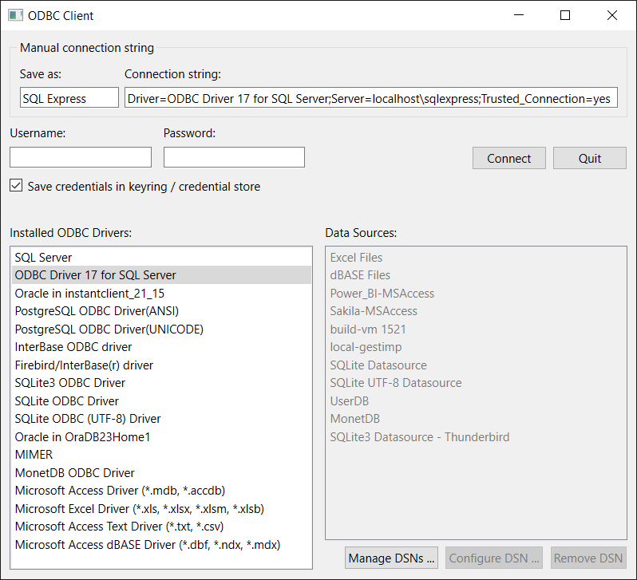
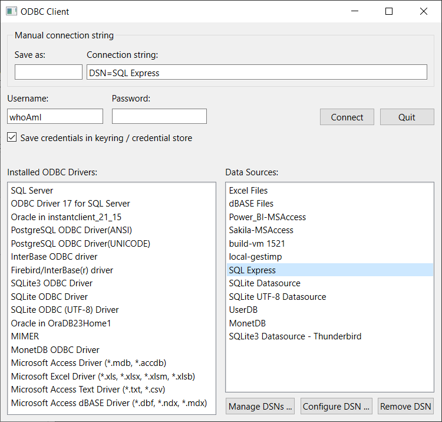
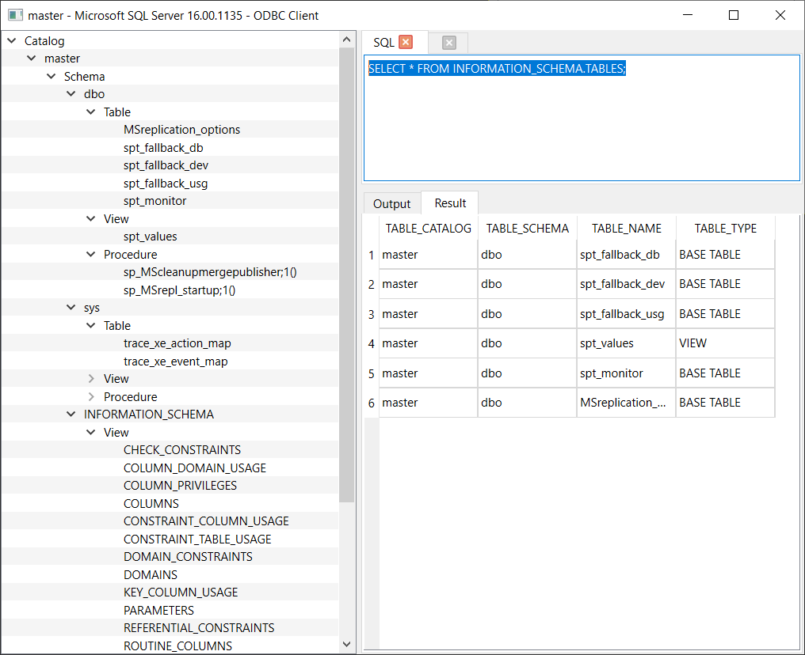

# ODBC GUI Client
GUI client application for ODBC databases (built using Qt and python)

Connect to a database or a data source using an ODBC connection string or an ODBC data source name (DSN), and test and run SQL queries supported by the data source.

Some aditional features like list of existing functions, tables and views are also available if provided by the data source.

If you have the connection details like a database name, server hostname, username, etc, you can build a connection string according to the documentation of the ODBC driver provided by the database. The resulting connection string can be saved as a data source name (DSN) for reconnecting later. Avoid writing the username and password inline in the connection string. Instead, you should use the dedicated username and password fields (these fields use the keyring to save the sensitive information).

All major databases (commercial and open-source) publish an ODBC driver for their product. Microsoft for example makes available ODBC drivers for reading Excel spreadsheets or Access databases,
(included with Office), SQL Server databases, even the old FoxPro had a driver, but you should have the specific product installed first.

Client-server databases also let you install the ODBC driver (as a client only) without installing the main product (the database server). In this case you can use the
driver to connect to a remote server, by specifying the server in the connection string.

## Installation
On Windows you should install [python](https://www.python.org/downloads/) (latest version), then install PySide6, Traits, pyodbc, keyring and crc with commands like:
```sh
python -m pip install PySide6 Traits pyodbc keyring crc
```
You may want to check the option to add python to the PATH environment variable, during installation of python. `pip` command (`python -m pip`) often recommends setting up a virtual environment for the above installation, but I always found it easier to use the direct installation, and running the `pip` command above as Administrator for this purpose.

On Linux systems (not implemented) using the distribution packages is preferred over the python `pip` packages. For example if your distribution uses rpms:
```sh
dnf install python3-pyside6 python3-Traits python3-pyodbc
```
if your distribution does not have one of the packages (like python3-pyside6), you can still use the `pip` command above to install it.

To start the application you should run the `odbc-client.py` script.

On Windows if python launcher is installed, or python is on PATH and is configured to run .py scripts, you can just say:
```cmd
odbc-client
```
from the project directory, or if that does not work use:
```cmd
python odbc-client.py
```
also from the main project directory.

To run a query like a SELECT in the editor, you should select the text of the query and press Ctrl + Enter.

## Screenshots
### Connection dialog

### Connection dialog

### Query window


## Sample application only
This application is only meant for learning and practicing Qt and python bindings, so it is not a full-blown database client with all possible features ('though I wish it could be).
